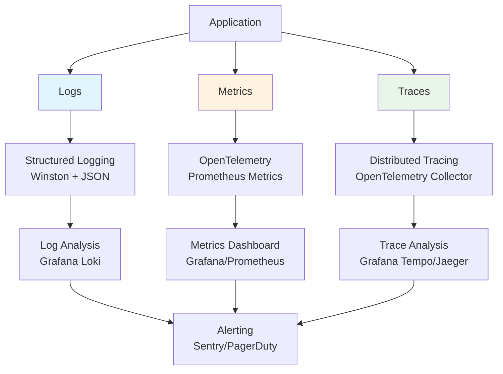

# 監視・ログ戦略ガイドライン

WebService-Next-Hono-Base を基盤とするWebサービス開発において、本番運用での問題検知・分析・パフォーマンス監視のための包括的な観測性（Observability）戦略を提供します。

---

## 🎯 ガイドラインの目的

このガイドラインは：
- **OpenTelemetry統合による分散トレーシング・メトリクス収集の実現**
- **構造化ログ設計による効率的なデバッグ・分析環境の構築**
- **Sentry統合によるリアルタイムエラートラッキング・アラートの実装**
- **APMダッシュボードによる包括的なパフォーマンス監視体制の確立**
- **SLI/SLO定義による定量的なサービス品質管理の導入**

---

## 📋 監視・ログ戦略の全体像

### 観測性の3本柱


### 監視レイヤー戦略

| レイヤー | 監視対象 | ツール | 目的 |
|---------|----------|-------|------|
| **Infrastructure** | サーバー・DB・ネットワーク | CloudWatch/DataDog | リソース監視・容量管理 |
| **Application** | API・Web・認証 | OpenTelemetry + Grafana | パフォーマンス・可用性監視 |
| **Business** | ユーザー行動・売上・KPI | Custom Metrics | ビジネス指標・成長監視 |
| **User Experience** | Core Web Vitals・エラー率 | Sentry + RUM | UX品質・満足度監視 |

---

## 📁 プロジェクトファイル構成

### 監視・ログ関連ディレクトリ構造
```
repo/
  packages/
    observability/                 # 観測性共通パッケージ
      src/
        logger/
          index.ts                 # 統一ログ設定
          formatters.ts            # ログフォーマッター
          transports.ts            # ログ転送設定
        telemetry/
          index.ts                 # OpenTelemetry設定
          traces.ts                # トレース設定
          metrics.ts               # メトリクス設定
        sentry/
          index.ts                 # Sentry統合設定
          error-handler.ts         # エラーハンドリング
      package.json
  ops/
    monitoring/
      grafana/
        dashboards/              # Grafanaダッシュボード定義
          api-performance.json
          web-vitals.json
          infrastructure.json
          audit-security.json   # 監査・セキュリティダッシュボード
          user-activity.json    # ユーザー行動分析ダッシュボード
        provisioning/            # Grafana設定
      prometheus/
        prometheus.yml           # Prometheusスクレイピング設定
        rules/                   # アラートルール
          api-alerts.yml
          infrastructure-alerts.yml
          security-alerts.yml    # セキュリティ・監査アラート
      docker-compose.monitoring.yml # 監視スタック
  dev/
    observability/
      scripts/
        setup-monitoring.sh      # ローカル監視環境セットアップ
        test-telemetry.sh        # テレメトリーテスト
      configs/
        otel-collector.yml       # OpenTelemetryコレクター設定
        tempo-config.yml         # Grafana Tempo設定
```

---

## 📊 構造化ログ設計

### 統一ログ設定

```typescript
// packages/observability/src/logger/index.ts
import winston from 'winston'
import { format } from 'winston'

// ログレベル定義
export enum LogLevel {
  ERROR = 'error',
  WARN = 'warn', 
  INFO = 'info',
  HTTP = 'http',
  DEBUG = 'debug'
}

// 構造化ログフォーマット
const logFormat = format.combine(
  format.timestamp({ format: 'YYYY-MM-DD HH:mm:ss.SSS' }),
  format.errors({ stack: true }),
  format.json(),
  format.printf(({ timestamp, level, message, service, traceId, spanId, userId, ...meta }) => {
    const logEntry = {
      '@timestamp': timestamp,
      level,
      message,
      service,
      trace: {
        trace_id: traceId,
        span_id: spanId
      },
      user: {
        id: userId
      },
      environment: process.env.NODE_ENV,
      version: process.env.APP_VERSION,
      ...meta
    }
    
    return JSON.stringify(logEntry)
  })
)

// 環境別ログ設定
const createLogger = (serviceName: string) => {
  const transports = []
  
  // 開発環境：コンソール出力（人間向け）
  if (process.env.NODE_ENV === 'development') {
    transports.push(
      new winston.transports.Console({
        format: format.combine(
          format.colorize(),
          format.simple()
        )
      })
    )
  }
  
  // 本番環境：JSON形式でファイル出力
  if (process.env.NODE_ENV === 'production') {
    transports.push(
      new winston.transports.File({
        filename: '/var/log/app/error.log',
        level: 'error',
        maxsize: 10485760, // 10MB
        maxFiles: 5
      }),
      new winston.transports.File({
        filename: '/var/log/app/combined.log',
        maxsize: 10485760,
        maxFiles: 10
      })
    )
  }
  
  // 常に標準出力（Docker/Kubernetes対応）
  transports.push(
    new winston.transports.Console({
      format: logFormat
    })
  )
  
  return winston.createLogger({
    level: process.env.LOG_LEVEL || 'info',
    format: logFormat,
    defaultMeta: { 
      service: serviceName,
      hostname: process.env.HOSTNAME || 'unknown'
    },
    transports
  })
}

export const logger = createLogger('webservice-app')
export { createLogger }
```

### アプリケーション別ログ実装

```typescript
// apps/api/src/middleware/logging.ts
import { Context, Next } from 'hono'
import { logger } from '@shared/observability'
import { trace, context } from '@opentelemetry/api'

export const loggingMiddleware = async (c: Context, next: Next) => {
  const start = Date.now()
  const traceId = trace.getActiveSpan()?.spanContext().traceId
  const spanId = trace.getActiveSpan()?.spanContext().spanId
  
  // リクエスト開始ログ
  logger.info('HTTP Request Started', {
    method: c.req.method,
    url: c.req.url,
    userAgent: c.req.header('user-agent'),
    ip: c.req.header('x-forwarded-for') || 'unknown',
    traceId,
    spanId
  })
  
  await next()
  
  const duration = Date.now() - start
  const status = c.res.status
  
  // リクエスト完了ログ
  const logLevel = status >= 500 ? 'error' : status >= 400 ? 'warn' : 'info'
  logger.log(logLevel, 'HTTP Request Completed', {
    method: c.req.method,
    url: c.req.url,
    status,
    duration,
    traceId,
    spanId
  })
}

// ビジネスロジックログ例
export const logUserAction = (action: string, userId: string, metadata?: object) => {
  logger.info('User Action', {
    action,
    userId,
    ...metadata,
    category: 'business'
  })
}

export const logDatabaseQuery = (query: string, duration: number, table: string) => {
  logger.debug('Database Query', {
    query: query.substring(0, 200), // クエリを短縮
    duration,
    table,
    category: 'database'
  })
}
```

```typescript
// apps/web/src/lib/client-logger.ts
import { logger } from '@shared/observability'

// フロントエンド用ログ（サーバーに送信）
export const clientLogger = {
  info: (message: string, meta?: object) => {
    // 開発環境はコンソール出力
    if (process.env.NODE_ENV === 'development') {
      console.log(`[INFO] ${message}`, meta)
    }
    
    // 本番環境はサーバーに送信
    if (typeof window !== 'undefined') {
      fetch('/api/v1/logs', {
        method: 'POST',
        headers: { 'Content-Type': 'application/json' },
        body: JSON.stringify({
          level: 'info',
          message,
          timestamp: new Date().toISOString(),
          userAgent: navigator.userAgent,
          url: window.location.href,
          ...meta
        })
      }).catch(() => {}) // エラーは無視（ログ送信失敗でアプリを止めない）
    }
  },
  
  error: (message: string, error?: Error, meta?: object) => {
    console.error(`[ERROR] ${message}`, error, meta)
    
    if (typeof window !== 'undefined') {
      fetch('/api/v1/logs', {
        method: 'POST',
        headers: { 'Content-Type': 'application/json' },
        body: JSON.stringify({
          level: 'error',
          message,
          error: error?.message,
          stack: error?.stack,
          timestamp: new Date().toISOString(),
          ...meta
        })
      }).catch(() => {})
    }
  }
}
```

---

## �️ 監査ログ・操作ログ戦略

### 監査ログの分類

| ログ種別 | 目的 | 保存期間 | 主要用途 |
|---------|------|----------|----------|
| **システムログ** | アプリケーション動作記録 | 30日 | デバッグ・パフォーマンス分析 |
| **アクセスログ** | HTTP リクエスト記録 | 90日 | トラフィック分析・セキュリティ監視 |
| **操作ログ** | ユーザー行動記録 | 1年 | ビジネス分析・UX改善 |
| **監査ログ** | セキュリティ関連操作 | 7年 | コンプライアンス・証跡管理 |

### 監査ログ設計

```typescript
// packages/observability/src/audit/audit-logger.ts
import { logger } from '../logger'
import { recordMetrics } from '../telemetry/metrics'

export interface AuditEvent {
  // WHO: 誰が
  actor: {
    userId: string
    email?: string
    role: string
    ip: string
    userAgent: string
    sessionId?: string
  }
  
  // WHAT: 何を
  action: string
  resource: {
    type: string // 'user', 'document', 'setting'
    id: string
    name?: string
  }
  
  // WHEN: いつ
  timestamp: string
  
  // WHERE: どこで
  context: {
    service: string
    endpoint: string
    method: string
  }
  
  // HOW: どのように
  details?: {
    oldValue?: any
    newValue?: any
    reason?: string
    metadata?: Record<string, any>
  }
  
  // RESULT: 結果
  result: 'success' | 'failure' | 'partial'
  errorMessage?: string
}

export class AuditLogger {
  // セキュリティ関連の監査ログ
  static logSecurityEvent(event: AuditEvent) {
    const auditEntry = {
      '@timestamp': event.timestamp,
      level: 'audit',
      message: `${event.action} by ${event.actor.email}`,
      category: 'security_audit',
      actor: event.actor,
      action: event.action,
      resource: event.resource,
      context: event.context,
      details: event.details,
      result: event.result,
      errorMessage: event.errorMessage
    }
    
    // 構造化ログに記録（長期保存）
    logger.info('Security Audit', auditEntry)
    
    // メトリクス更新
    recordMetrics.auditEvent(event.action, event.result, event.actor.role)
  }
  
  // データ操作の監査ログ
  static logDataEvent(event: AuditEvent) {
    const auditEntry = {
      '@timestamp': event.timestamp,
      level: 'audit',
      message: `Data ${event.action}: ${event.resource.type}`,
      category: 'data_audit',
      actor: event.actor,
      action: event.action,
      resource: event.resource,
      details: event.details,
      result: event.result
    }
    
    logger.info('Data Audit', auditEntry)
    recordMetrics.dataOperation(event.action, event.resource.type, event.result)
  }
  
  // GDPR関連の監査ログ
  static logGDPREvent(event: AuditEvent & { legalBasis: string }) {
    const auditEntry = {
      '@timestamp': event.timestamp,
      level: 'audit',
      message: `GDPR ${event.action}`,
      category: 'gdpr_audit',
      actor: event.actor,
      action: event.action,
      resource: event.resource,
      legalBasis: event.legalBasis,
      details: event.details,
      result: event.result
    }
    
    logger.warn('GDPR Audit', auditEntry)
    recordMetrics.gdprOperation(event.action, event.legalBasis)
  }
}
```

### 実装例：認証・認可の監査

```typescript
// apps/api/src/middleware/audit-middleware.ts
import { Context, Next } from 'hono'
import { AuditLogger } from '@shared/observability'
import { getClientInfo } from '../utils/request'

export const auditMiddleware = async (c: Context, next: Next) => {
  const startTime = Date.now()
  const user = c.get('user') // 認証ミドルウェアから取得
  const clientInfo = getClientInfo(c.req)
  
  // 認証が必要なエンドポイントのみ監査
  const isAuditable = c.req.path.startsWith('/api/v1/admin') || 
                     c.req.path.includes('/users/') ||
                     ['POST', 'PUT', 'DELETE'].includes(c.req.method)
  
  if (!isAuditable) {
    return next()
  }
  
  await next()
  
  const duration = Date.now() - startTime
  const status = c.res.status
  
  // 監査ログ記録
  AuditLogger.logSecurityEvent({
    actor: {
      userId: user?.id || 'anonymous',
      email: user?.email,
      role: user?.role || 'guest',
      ip: clientInfo.ip,
      userAgent: clientInfo.userAgent,
      sessionId: c.get('sessionId')
    },
    action: `${c.req.method} ${c.req.path}`,
    resource: {
      type: 'api_endpoint',
      id: c.req.path,
      name: c.req.path
    },
    timestamp: new Date().toISOString(),
    context: {
      service: 'api',
      endpoint: c.req.path,
      method: c.req.method
    },
    details: {
      duration,
      requestSize: c.req.header('content-length'),
      responseSize: c.res.headers.get('content-length')
    },
    result: status < 400 ? 'success' : 'failure',
    errorMessage: status >= 400 ? `HTTP ${status}` : undefined
  })
}
```

### 操作ログの収集

```typescript
// packages/observability/src/activity/activity-logger.ts
export interface UserActivity {
  userId: string
  sessionId: string
  action: string
  target?: {
    type: string
    id: string
  }
  metadata?: Record<string, any>
  timestamp: string
  source: 'web' | 'api' | 'mobile'
}

export class ActivityLogger {
  // ユーザー行動ログ
  static logUserActivity(activity: UserActivity) {
    logger.info('User Activity', {
      '@timestamp': activity.timestamp,
      level: 'info',
      message: `User activity: ${activity.action}`,
      category: 'user_activity',
      userId: activity.userId,
      sessionId: activity.sessionId,
      action: activity.action,
      target: activity.target,
      metadata: activity.metadata,
      source: activity.source
    })
    
    // ビジネスメトリクス更新
    recordMetrics.userActivity(activity.action, activity.source)
  }
  
  // ページビュー・クリック追跡
  static logPageView(userId: string, page: string, referrer?: string) {
    this.logUserActivity({
      userId,
      sessionId: '', // フロントエンドから取得
      action: 'page_view',
      target: { type: 'page', id: page },
      metadata: { referrer },
      timestamp: new Date().toISOString(),
      source: 'web'
    })
  }
  
  // API使用状況追跡
  static logAPIUsage(userId: string, endpoint: string, method: string) {
    this.logUserActivity({
      userId,
      sessionId: '', 
      action: 'api_call',
      target: { type: 'endpoint', id: endpoint },
      metadata: { method },
      timestamp: new Date().toISOString(),
      source: 'api'
    })
  }
}
```

### 長期保存・アーカイブ戦略

```yaml
# ops/monitoring/loki/retention-config.yml
# Loki保存期間設定
retention_period: 2160h  # 90日

table_manager:
  retention_deletes_enabled: true
  retention_period: 2160h

# 監査ログ専用の長期保存設定
limits_config:
  retention_period: 61320h  # 7年 (GDPR要件)
  
# 監査ログを別インデックスで管理
schema_config:
  configs:
    - from: 2024-01-01
      store: boltdb-shipper
      object_store: filesystem
      schema: v11
      index:
        prefix: audit_
        period: 24h
```

---

## �🔍 OpenTelemetry統合・分散トレーシング

### OpenTelemetry設定

```typescript
// packages/observability/src/telemetry/index.ts
import { NodeSDK } from '@opentelemetry/auto-instrumentations-node'
import { getNodeAutoInstrumentations } from '@opentelemetry/auto-instrumentations-node'
import { PeriodicExportingMetricReader } from '@opentelemetry/sdk-metrics'
import { Resource } from '@opentelemetry/resources'
import { SemanticResourceAttributes } from '@opentelemetry/semantic-conventions'
import { OTLPTraceExporter } from '@opentelemetry/exporter-trace-otlp-http'
import { OTLPMetricExporter } from '@opentelemetry/exporter-metrics-otlp-http'

// リソース定義
const resource = Resource.default().merge(
  new Resource({
    [SemanticResourceAttributes.SERVICE_NAME]: process.env.SERVICE_NAME || 'webservice-app',
    [SemanticResourceAttributes.SERVICE_VERSION]: process.env.APP_VERSION || '1.0.0',
    [SemanticResourceAttributes.DEPLOYMENT_ENVIRONMENT]: process.env.NODE_ENV || 'development'
  })
)

// OpenTelemetry Collector経由でトレース送信
const traceExporter = new OTLPTraceExporter({
  url: process.env.OTEL_EXPORTER_OTLP_TRACES_ENDPOINT || 'http://localhost:4318/v1/traces',
  headers: {}
})

// メトリクスエクスポーター設定
# メトリクスエクスポーター設定（Collector経由）
const metricExporter = new OTLPMetricExporter({
  url: process.env.OTEL_EXPORTER_OTLP_METRICS_ENDPOINT || 'http://localhost:4318/v1/metrics'
})

// OpenTelemetry SDK初期化
export const initializeTelemetry = () => {
  const sdk = new NodeSDK({
    resource,
    traceExporter,
    metricReader: new PeriodicExportingMetricReader({
      exporter: metricExporter,
      exportIntervalMillis: 5000
    }),
    instrumentations: [
      getNodeAutoInstrumentations({
        // 自動計装設定
        '@opentelemetry/instrumentation-fs': { enabled: false }, // ファイルシステム除外
        '@opentelemetry/instrumentation-http': {
          enabled: true,
          requestHook: (span, request) => {
            span.setAttributes({
              'http.request.header.user-agent': request.getHeader('user-agent'),
              'http.request.header.x-forwarded-for': request.getHeader('x-forwarded-for')
            })
          }
        }
      })
    ]
  })
  
  sdk.start()
  
  process.on('SIGTERM', () => {
    sdk.shutdown()
      .then(() => console.log('OpenTelemetry terminated'))
      .catch(error => console.error('Error terminating OpenTelemetry', error))
      .finally(() => process.exit(0))
  })
  
  return sdk
}
```

### カスタムメトリクス設計

```typescript
// packages/observability/src/telemetry/metrics.ts
import { metrics } from '@opentelemetry/api'
import { MeterProvider } from '@opentelemetry/sdk-metrics'

const meter = metrics.getMeter('webservice-app', '1.0.0')

// API パフォーマンスメトリクス
export const apiMetrics = {
  requestDuration: meter.createHistogram('http_request_duration_ms', {
    description: 'HTTP request duration in milliseconds',
    unit: 'ms'
  }),
  
  requestCounter: meter.createCounter('http_requests_total', {
    description: 'Total number of HTTP requests'
  }),
  
  activeConnections: meter.createUpDownCounter('http_active_connections', {
    description: 'Number of active HTTP connections'
  })
}

// データベースメトリクス
export const dbMetrics = {
  queryDuration: meter.createHistogram('db_query_duration_ms', {
    description: 'Database query duration in milliseconds',
    unit: 'ms'
  }),
  
  connectionPool: meter.createGauge('db_connection_pool_size', {
    description: 'Database connection pool size'
  }),
  
  slowQueries: meter.createCounter('db_slow_queries_total', {
    description: 'Total number of slow database queries'
  })
}

// ビジネスメトリクス
export const businessMetrics = {
  userRegistrations: meter.createCounter('user_registrations_total', {
    description: 'Total number of user registrations'
  }),
  
  userLogins: meter.createCounter('user_logins_total', {
    description: 'Total number of user logins'
  }),
  
  activeUsers: meter.createGauge('active_users_current', {
    description: 'Number of currently active users'
  })
}

// 監査・セキュリティメトリクス
export const auditMetrics = {
  auditEvents: meter.createCounter('audit_events_total', {
    description: 'Total number of audit events'
  }),
  
  securityViolations: meter.createCounter('security_violations_total', {
    description: 'Total number of security violations'
  }),
  
  dataOperations: meter.createCounter('data_operations_total', {
    description: 'Total number of data operations'
  }),
  
  gdprRequests: meter.createCounter('gdpr_requests_total', {
    description: 'Total number of GDPR requests'
  })
}

// メトリクス記録ヘルパー
export const recordMetrics = {
  httpRequest: (method: string, route: string, status: number, duration: number) => {
    apiMetrics.requestDuration.record(duration, {
      method,
      route,
      status: status.toString()
    })
    
    apiMetrics.requestCounter.add(1, {
      method,
      route,
      status: status.toString()
    })
  },
  
  dbQuery: (operation: string, table: string, duration: number) => {
    dbMetrics.queryDuration.record(duration, {
      operation,
      table
    })
    
    if (duration > 1000) { // 1秒以上のクエリは遅いと判定
      dbMetrics.slowQueries.add(1, {
        operation,
        table
      })
    }
  },
  
  userAction: (action: 'register' | 'login' | 'logout') => {
    switch (action) {
      case 'register':
        businessMetrics.userRegistrations.add(1)
        break
      case 'login':
        businessMetrics.userLogins.add(1)
        break
    }
  },
  
  // 監査ログメトリクス
  auditEvent: (action: string, result: string, role: string) => {
    auditMetrics.auditEvents.add(1, {
      action,
      result,
      role
    })
  },
  
  dataOperation: (operation: string, resourceType: string, result: string) => {
    auditMetrics.dataOperations.add(1, {
      operation,
      resource_type: resourceType,
      result
    })
  },
  
  gdprOperation: (operation: string, legalBasis: string) => {
    auditMetrics.gdprRequests.add(1, {
      operation,
      legal_basis: legalBasis
    })
  },
  
  userActivity: (action: string, source: string) => {
    businessMetrics.userLogins.add(1, {
      action,
      source
    })
  }
}
```

### トレーシング実装

```typescript
// packages/observability/src/telemetry/traces.ts
import { trace, context, SpanStatusCode, SpanKind } from '@opentelemetry/api'

const tracer = trace.getTracer('webservice-app', '1.0.0')

// API エンドポイントトレーシング
export const traceApiEndpoint = async <T>(
  operationName: string,
  operation: () => Promise<T>,
  attributes?: Record<string, string | number | boolean>
): Promise<T> => {
  return tracer.startActiveSpan(operationName, {
    kind: SpanKind.SERVER,
    attributes: {
      'operation.name': operationName,
      ...attributes
    }
  }, async (span) => {
    try {
      const result = await operation()
      span.setStatus({ code: SpanStatusCode.OK })
      return result
    } catch (error) {
      span.setStatus({
        code: SpanStatusCode.ERROR,
        message: error instanceof Error ? error.message : 'Unknown error'
      })
      span.recordException(error as Error)
      throw error
    } finally {
      span.end()
    }
  })
}

// データベースクエリトレーシング
export const traceDbQuery = async <T>(
  queryName: string,
  table: string,
  operation: () => Promise<T>
): Promise<T> => {
  return tracer.startActiveSpan(`db.${table}.${queryName}`, {
    kind: SpanKind.CLIENT,
    attributes: {
      'db.system': 'postgresql',
      'db.name': process.env.DB_NAME,
      'db.operation': queryName,
      'db.table': table
    }
  }, async (span) => {
    const start = Date.now()
    
    try {
      const result = await operation()
      const duration = Date.now() - start
      
      span.setAttributes({
        'db.duration': duration
      })
      span.setStatus({ code: SpanStatusCode.OK })
      
      return result
    } catch (error) {
      span.setStatus({
        code: SpanStatusCode.ERROR,
        message: error instanceof Error ? error.message : 'Database error'
      })
      span.recordException(error as Error)
      throw error
    } finally {
      span.end()
    }
  })
}

// 外部API呼び出しトレーシング
export const traceExternalApi = async <T>(
  serviceName: string,
  endpoint: string,
  operation: () => Promise<T>
): Promise<T> => {
  return tracer.startActiveSpan(`external.${serviceName}`, {
    kind: SpanKind.CLIENT,
    attributes: {
      'http.url': endpoint,
      'service.name': serviceName
    }
  }, async (span) => {
    try {
      const result = await operation()
      span.setStatus({ code: SpanStatusCode.OK })
      return result
    } catch (error) {
      span.setStatus({
        code: SpanStatusCode.ERROR,
        message: `External API error: ${serviceName}`
      })
      span.recordException(error as Error)
      throw error
    } finally {
      span.end()
    }
  })
}
```

---

## 🚨 Sentry統合・エラートラッキング

### Sentry設定

```typescript
// packages/observability/src/sentry/index.ts
import * as Sentry from '@sentry/node'
import * as SentryTracing from '@sentry/tracing'
import { logger } from '../logger'

export const initializeSentry = () => {
  Sentry.init({
    dsn: process.env.SENTRY_DSN,
    environment: process.env.NODE_ENV,
    release: process.env.APP_VERSION,
    
    // パフォーマンス監視
    tracesSampleRate: process.env.NODE_ENV === 'production' ? 0.1 : 1.0,
    
    // セッションリプレイ（フロントエンドのみ）
    replaysSessionSampleRate: 0.1,
    replaysOnErrorSampleRate: 1.0,
    
    // 統合設定
    integrations: [
      new SentryTracing.Integrations.Http({ tracing: true }),
      new SentryTracing.Integrations.Express({ app: undefined }),
      new Sentry.Integrations.OnUncaughtException(),
      new Sentry.Integrations.OnUnhandledRejection()
    ],
    
    // エラーフィルタリング
    beforeSend(event, hint) {
      // 開発環境では全てコンソールにも出力
      if (process.env.NODE_ENV === 'development') {
        console.error('Sentry Error:', event, hint)
      }
      
      // スパム的なエラーをフィルタ
      if (event.exception) {
        const error = hint.originalException as Error
        if (error?.message?.includes('ECONNRESET')) {
          return null // ネットワークエラーは無視
        }
      }
      
      return event
    },
    
    // コンテキスト設定
    initialScope: {
      tags: {
        component: 'webservice-app'
      }
    }
  })
  
  // プロセス終了時のクリーンアップ
  process.on('beforeExit', () => {
    Sentry.close(2000)
  })
}

// カスタムエラーハンドリング
export const captureError = (error: Error, context?: Record<string, any>) => {
  Sentry.withScope((scope) => {
    if (context) {
      scope.setContext('custom', context)
    }
    Sentry.captureException(error)
  })
  
  // ログにも記録
  logger.error('Application Error', {
    message: error.message,
    stack: error.stack,
    ...context
  })
}

// ビジネスロジックエラー
export const captureBusinessError = (
  message: string, 
  level: 'warning' | 'error' = 'error',
  context?: Record<string, any>
) => {
  Sentry.withScope((scope) => {
    scope.setLevel(level)
    if (context) {
      scope.setContext('business', context)
    }
    Sentry.captureMessage(message)
  })
  
  logger.log(level === 'warning' ? 'warn' : 'error', message, context)
}

// パフォーマンス監視
export const measurePerformance = <T>(
  operationName: string,
  operation: () => Promise<T>
): Promise<T> => {
  const transaction = Sentry.startTransaction({
    op: 'custom',
    name: operationName
  })
  
  return operation()
    .then(result => {
      transaction.setStatus('ok')
      return result
    })
    .catch(error => {
      transaction.setStatus('internal_error')
      captureError(error, { operation: operationName })
      throw error
    })
    .finally(() => {
      transaction.finish()
    })
}
```

### API・Web統合

```typescript
// apps/api/src/middleware/sentry.ts
import { Context, Next } from 'hono'
import * as Sentry from '@sentry/node'
import { captureError } from '@shared/observability'

export const sentryMiddleware = async (c: Context, next: Next) => {
  const transaction = Sentry.startTransaction({
    op: 'http.server',
    name: `${c.req.method} ${c.req.path}`
  })
  
  Sentry.getCurrentHub().configureScope(scope => {
    scope.setSpan(transaction)
    scope.setContext('http', {
      method: c.req.method,
      url: c.req.url,
      headers: Object.fromEntries(c.req.headers.entries())
    })
  })
  
  try {
    await next()
    transaction.setStatus('ok')
  } catch (error) {
    transaction.setStatus('internal_error')
    captureError(error as Error, {
      request: {
        method: c.req.method,
        url: c.req.url
      }
    })
    throw error
  } finally {
    transaction.finish()
  }
}
```

```typescript
// apps/web/src/lib/sentry-client.ts
import * as Sentry from '@sentry/nextjs'

export const initializeClientSentry = () => {
  Sentry.init({
    dsn: process.env.NEXT_PUBLIC_SENTRY_DSN,
    environment: process.env.NODE_ENV,
    
    // パフォーマンス監視
    tracesSampleRate: 0.1,
    
    // セッションリプレイ
    replaysSessionSampleRate: 0.1,
    replaysOnErrorSampleRate: 1.0,
    
    // React エラーバウンダリー
    beforeCapture: (scope, hint) => {
      if (hint.originalException instanceof Error) {
        scope.setTag('errorBoundary', 'true')
      }
    }
  })
}

// React Error Boundary
export const SentryErrorBoundary = Sentry.withErrorBoundary
```

---

## 📈 ダッシュボード・可視化

### Grafana統合設定

```yaml
# Grafana データソース設定
datasources:
  # メトリクス
  - name: Prometheus
    type: prometheus
    url: http://prometheus:9090
    
  # ログ  
  - name: Loki
    type: loki
    url: http://loki:3100
    
  # トレース
  - name: Tempo
    type: tempo
    url: http://tempo:3200
    
  # トレース連携設定
  - name: Jaeger
    type: jaeger
    url: http://jaeger:16686
```

### Grafana ダッシュボード設定

```json
// ops/monitoring/grafana/dashboards/api-performance.json
{
  "dashboard": {
    "id": null,
    "title": "API Performance Dashboard",
    "tags": ["webservice", "api", "performance"],
    "timezone": "browser",
    "panels": [
      {
        "id": 1,
        "title": "Request Rate",
        "type": "stat",
        "targets": [
          {
            "expr": "sum(rate(http_requests_total[5m]))",
            "legendFormat": "Requests/sec"
          }
        ],
        "fieldConfig": {
          "defaults": {
            "color": {
              "mode": "thresholds"
            },
            "thresholds": {
              "steps": [
                {"color": "green", "value": null},
                {"color": "yellow", "value": 100},
                {"color": "red", "value": 1000}
              ]
            }
          }
        }
      },
      {
        "id": 2,
        "title": "Response Time P95",
        "type": "stat",
        "targets": [
          {
            "expr": "histogram_quantile(0.95, sum(rate(http_request_duration_ms_bucket[5m])) by (le))",
            "legendFormat": "P95 Response Time"
          }
        ],
        "fieldConfig": {
          "defaults": {
            "unit": "ms",
            "thresholds": {
              "steps": [
                {"color": "green", "value": null},
                {"color": "yellow", "value": 500},
                {"color": "red", "value": 1000}
              ]
            }
          }
        }
      },
      {
        "id": 3,
        "title": "Error Rate",
        "type": "stat", 
        "targets": [
          {
            "expr": "sum(rate(http_requests_total{status=~\"5..\"}[5m])) / sum(rate(http_requests_total[5m])) * 100",
            "legendFormat": "Error Rate %"
          }
        ],
        "fieldConfig": {
          "defaults": {
            "unit": "percent",
            "thresholds": {
              "steps": [
                {"color": "green", "value": null},
                {"color": "yellow", "value": 1},
                {"color": "red", "value": 5}
              ]
            }
          }
        }
      },
      {
        "id": 4,
        "title": "Request Duration Heatmap",
        "type": "heatmap",
        "targets": [
          {
            "expr": "sum(increase(http_request_duration_ms_bucket[1m])) by (le)",
            "format": "heatmap",
            "legendFormat": "{{le}}"
          }
        ]
      }
    ]
  }
}
```

### アラートルール設定

```yaml
# ops/monitoring/prometheus/rules/api-alerts.yml
groups:
  - name: api.rules
    rules:
      # 高いエラー率
      - alert: HighErrorRate
        expr: sum(rate(http_requests_total{status=~"5.."}[5m])) / sum(rate(http_requests_total[5m])) > 0.05
        for: 2m
        labels:
          severity: warning
          service: api
        annotations:
          summary: "High error rate detected"
          description: "Error rate is {{ $value | humanizePercentage }} for the last 5 minutes"
          
      # 遅いレスポンス時間
      - alert: HighResponseTime
        expr: histogram_quantile(0.95, sum(rate(http_request_duration_ms_bucket[5m])) by (le)) > 1000
        for: 5m
        labels:
          severity: warning
          service: api
        annotations:
          summary: "High response time detected"
          description: "95th percentile response time is {{ $value }}ms"
          
      # データベース接続プールが満杯
      - alert: DatabaseConnectionPoolFull
        expr: db_connection_pool_size >= db_connection_pool_max * 0.9
        for: 1m
        labels:
          severity: critical
          service: database
        annotations:
          summary: "Database connection pool nearly full"
          description: "Connection pool usage: {{ $value }}/{{ $labels.max }}"
          
      # メモリ使用率が高い
      - alert: HighMemoryUsage
        expr: (node_memory_MemTotal_bytes - node_memory_MemAvailable_bytes) / node_memory_MemTotal_bytes > 0.85
        for: 5m
        labels:
          severity: warning
          service: infrastructure
        annotations:
          summary: "High memory usage"
          description: "Memory usage is {{ $value | humanizePercentage }}"

# ops/monitoring/prometheus/rules/security-alerts.yml
groups:
  - name: security.rules
    rules:
      # 大量のログイン失敗
      - alert: HighLoginFailureRate
        expr: sum(rate(audit_events_total{action="login",result="failure"}[5m])) > 10
        for: 2m
        labels:
          severity: warning
          category: security
        annotations:
          summary: "High login failure rate detected"
          description: "{{ $value }} login failures per second in the last 5 minutes"
          
      # 権限昇格の試行
      - alert: PrivilegeEscalationAttempt
        expr: sum(rate(audit_events_total{action=~".*admin.*|.*privilege.*"}[5m])) > 0
        for: 1m
        labels:
          severity: critical
          category: security
        annotations:
          summary: "Privilege escalation attempt detected"
          description: "Suspicious privilege escalation activity detected"
          
      # 大量のデータアクセス
      - alert: MassDataAccess
        expr: sum(rate(data_operations_total{operation="read"}[10m])) > 100
        for: 5m
        labels:
          severity: warning
          category: security
        annotations:
          summary: "Mass data access detected"
          description: "Unusually high data access rate: {{ $value }} operations/sec"
          
      # GDPR要求の急増
      - alert: HighGDPRRequestRate
        expr: sum(rate(gdpr_requests_total[1h])) > 5
        for: 10m
        labels:
          severity: info
          category: compliance
        annotations:
          summary: "High GDPR request rate"
          description: "{{ $value }} GDPR requests in the last hour"
```

---

## 🎯 SLI/SLO定義・品質目標

### サービスレベル指標（SLI）

```typescript
// packages/observability/src/sli-slo/definitions.ts

export interface SLI {
  name: string
  description: string
  query: string
  unit: string
  target: number
  window: string
}

export const serviceLevelIndicators: SLI[] = [
  // 可用性（Availability）
  {
    name: 'api_availability',
    description: 'API endpoint availability (non-5xx responses)',
    query: 'sum(rate(http_requests_total{status!~"5.."}[5m])) / sum(rate(http_requests_total[5m]))',
    unit: 'percent',
    target: 99.9, // 99.9% uptime
    window: '30d'
  },
  
  // レスポンス時間（Latency）
  {
    name: 'api_latency_p95',
    description: '95th percentile API response time',
    query: 'histogram_quantile(0.95, sum(rate(http_request_duration_ms_bucket[5m])) by (le))',
    unit: 'milliseconds',
    target: 500, // 500ms以下
    window: '7d'
  },
  
  // エラー率（Error Rate）
  {
    name: 'api_error_rate',
    description: 'API error rate (5xx responses)',
    query: 'sum(rate(http_requests_total{status=~"5.."}[5m])) / sum(rate(http_requests_total[5m]))',
    unit: 'percent',
    target: 0.1, // 0.1%以下
    window: '30d'
  },
  
  // スループット（Throughput）
  {
    name: 'api_throughput',
    description: 'API request throughput',
    query: 'sum(rate(http_requests_total[5m]))',
    unit: 'requests_per_second',
    target: 1000, // 最低1000 req/s処理可能
    window: '7d'
  }
]
```

### SLOモニタリング

```typescript
// packages/observability/src/sli-slo/monitoring.ts
import { metrics } from '@opentelemetry/api'
import { serviceLevelIndicators } from './definitions'

const meter = metrics.getMeter('slo-monitoring', '1.0.0')

// SLOメトリクス
const sloMetrics = {
  budget: meter.createGauge('slo_error_budget_remaining', {
    description: 'Remaining error budget percentage'
  }),
  
  burnRate: meter.createGauge('slo_burn_rate', {
    description: 'Current error budget burn rate'
  })
}

export class SLOMonitor {
  private errorBudgets: Map<string, number> = new Map()
  
  constructor() {
    // 初期エラーバジェット設定（月次）
    serviceLevelIndicators.forEach(sli => {
      const monthlyBudget = this.calculateMonthlyBudget(sli.target)
      this.errorBudgets.set(sli.name, monthlyBudget)
    })
  }
  
  // 月次エラーバジェット計算
  private calculateMonthlyBudget(target: number): number {
    const daysInMonth = 30
    const minutesInMonth = daysInMonth * 24 * 60
    const allowedErrorMinutes = minutesInMonth * ((100 - target) / 100)
    return allowedErrorMinutes
  }
  
  // SLO違反チェック
  async checkSLOViolations(): Promise<void> {
    for (const sli of serviceLevelIndicators) {
      const currentValue = await this.querySLI(sli.query)
      const isViolation = this.checkViolation(sli, currentValue)
      
      if (isViolation) {
        this.handleSLOViolation(sli, currentValue)
      }
      
      // エラーバジェット更新
      this.updateErrorBudget(sli.name, currentValue)
    }
  }
  
  private checkViolation(sli: SLI, currentValue: number): boolean {
    switch (sli.name) {
      case 'api_availability':
        return currentValue < sli.target
      case 'api_latency_p95':
        return currentValue > sli.target
      case 'api_error_rate':
        return currentValue > sli.target
      default:
        return false
    }
  }
  
  private handleSLOViolation(sli: SLI, currentValue: number): void {
    console.error(`SLO Violation: ${sli.name}`, {
      target: sli.target,
      current: currentValue,
      description: sli.description
    })
    
    // アラート送信
    this.sendAlert(sli, currentValue)
  }
  
  private updateErrorBudget(sliName: string, currentValue: number): void {
    const remainingBudget = this.errorBudgets.get(sliName) || 0
    // バジェット計算ロジック...
    
    sloMetrics.budget.record(remainingBudget, { sli: sliName })
  }
  
  private async querySLI(query: string): Promise<number> {
    // Prometheus/メトリクスストレージからクエリ実行
    // 実装は使用するメトリクスストレージに依存
    return 0 // プレースホルダー
  }
  
  private sendAlert(sli: SLI, currentValue: number): void {
    // Slack/PagerDuty/メール通知
    console.log(`🚨 SLO Alert: ${sli.name} - ${currentValue}`)
  }
}
```

---

## 🚀 実装タスク・セットアップ手順

### 1. 依存関係インストール

```json
// package.json（各パッケージ）
{
  "dependencies": {
    "winston": "^3.10.0",
    "@opentelemetry/api": "^1.6.0",
    "@opentelemetry/sdk-node": "^0.45.0",
    "@opentelemetry/auto-instrumentations-node": "^0.40.0",
    "@opentelemetry/exporter-trace-otlp-http": "^0.45.0",
    "@opentelemetry/exporter-metrics-otlp-http": "^0.45.0",
    "@sentry/node": "^7.77.0",
    "@sentry/nextjs": "^7.77.0",
    "@sentry/tracing": "^7.77.0"
  },
  "devDependencies": {
    "@types/winston": "^2.4.4"
  }
}
```

### 2. 監視スタック起動

```yaml
# ops/monitoring/docker-compose.monitoring.yml
version: '3.8'

services:
  # Prometheus - メトリクス収集
  prometheus:
    image: prom/prometheus:latest
    ports:
      - "9090:9090"
    volumes:
      - ./prometheus/prometheus.yml:/etc/prometheus/prometheus.yml
      - ./prometheus/rules:/etc/prometheus/rules
    command:
      - '--config.file=/etc/prometheus/prometheus.yml'
      - '--storage.tsdb.path=/prometheus'
      - '--web.console.libraries=/usr/share/prometheus/console_libraries'
      - '--web.console.templates=/usr/share/prometheus/consoles'
      - '--web.enable-lifecycle'
      - '--web.enable-admin-api'

  # Grafana - 可視化ダッシュボード
  grafana:
    image: grafana/grafana:latest
    ports:
      - "3001:3000"
    environment:
      - GF_SECURITY_ADMIN_PASSWORD=admin
    volumes:
      - ./grafana/dashboards:/var/lib/grafana/dashboards
      - ./grafana/provisioning:/etc/grafana/provisioning

  # OpenTelemetry Collector - テレメトリーデータ収集・転送
  otel-collector:
    image: otel/opentelemetry-collector-contrib:latest
    ports:
      - "4317:4317"   # OTLP gRPC
      - "4318:4318"   # OTLP HTTP
      - "8888:8888"   # Prometheus metrics
    volumes:
      - ./dev/observability/configs/otel-collector.yml:/etc/otelcol-contrib/otel-collector.yml
    command: ["--config=/etc/otelcol-contrib/otel-collector.yml"]
    depends_on:
      - prometheus
      - tempo
      - loki

  # Grafana Tempo - 分散トレーシングストレージ
  tempo:
    image: grafana/tempo:latest
    ports:
      - "3200:3200"   # Tempo HTTP
    volumes:
      - ./dev/observability/configs/tempo-config.yml:/etc/tempo.yml
    command: ["-config.file=/etc/tempo.yml"]

  # Loki - ログ集約
  loki:
    image: grafana/loki:latest
    ports:
      - "3100:3100"
    volumes:
      - ./loki/loki-config.yml:/etc/loki/local-config.yaml
    command: -config.file=/etc/loki/local-config.yaml

  # Promtail - ログ収集
  promtail:
    image: grafana/promtail:latest
    volumes:
      - /var/log:/var/log:ro
      - ./promtail/promtail-config.yml:/etc/promtail/config.yml
    command: -config.file=/etc/promtail/config.yml
```

### 3. アプリケーション統合

```typescript
// apps/api/src/index.ts
import { initializeTelemetry } from '@shared/observability'
import { initializeSentry } from '@shared/observability'

// 監視・ログ初期化（アプリケーション起動前）
initializeTelemetry()
initializeSentry()

// 既存のアプリケーションコード...
```

### 4. OpenTelemetry Collector設定

```yaml
# dev/observability/configs/otel-collector.yml
receivers:
  otlp:
    protocols:
      grpc:
        endpoint: 0.0.0.0:4317
      http:
        endpoint: 0.0.0.0:4318

processors:
  batch:
    timeout: 1s
    send_batch_size: 1024
  resource:
    attributes:
      - key: environment
        value: ${env:NODE_ENV}
        action: upsert

exporters:
  # Prometheus (メトリクス)
  prometheus:
    endpoint: "0.0.0.0:8888"
    
  # Grafana Tempo (トレース)
  otlp/tempo:
    endpoint: http://tempo:3200
    tls:
      insecure: true
      
  # Grafana Loki (ログ) 
  loki:
    endpoint: http://loki:3100/loki/api/v1/push
    
  # Jaeger (トレース - オプション)
  jaeger:
    endpoint: jaeger:14250
    tls:
      insecure: true

service:
  pipelines:
    traces:
      receivers: [otlp]
      processors: [batch, resource]
      exporters: [otlp/tempo, jaeger]
    metrics:
      receivers: [otlp]
      processors: [batch, resource]
      exporters: [prometheus]
    logs:
      receivers: [otlp]
      processors: [batch, resource]
      exporters: [loki]
```

### 5. Grafana Tempo設定

```yaml
# dev/observability/configs/tempo-config.yml
server:
  http_listen_port: 3200

distributor:
  receivers:
    otlp:
      protocols:
        grpc:
          endpoint: 0.0.0.0:4317
        http:
          endpoint: 0.0.0.0:4318

ingester:
  trace_idle_period: 10s
  max_block_bytes: 1_000_000
  max_block_duration: 5m

storage:
  trace:
    backend: local
    local:
      path: /tmp/tempo/traces
    wal:
      path: /tmp/tempo/wal

compactor:
  compaction:
    compaction_window: 1h
    max_compaction_objects: 1000000
    block_retention: 1h
    compacted_block_retention: 10m
```

### 6. 環境変数設定

```bash
# Infisical環境変数追加
# 監視・ログ関連
SENTRY_DSN=https://xxx@sentry.io/xxx
OTEL_EXPORTER_OTLP_TRACES_ENDPOINT=http://localhost:4318/v1/traces
OTEL_EXPORTER_OTLP_METRICS_ENDPOINT=http://localhost:4318/v1/metrics
LOG_LEVEL=info

# アプリケーション情報
SERVICE_NAME=webservice-api
APP_VERSION=1.0.0
OTEL_SERVICE_NAME=webservice-api
OTEL_SERVICE_VERSION=1.0.0
```

---

## ✅ 監視・ログ戦略チェックリスト

### 基本実装
- [ ] Winston構造化ログ設定完了
- [ ] OpenTelemetry SDK統合・初期化
- [ ] Sentry エラートラッキング設定
- [ ] 基本メトリクス収集（HTTP、DB）
- [ ] 環境別ログ設定（dev/staging/prod）

### 監視ダッシュボード
- [ ] Grafana ダッシュボード作成
- [ ] API パフォーマンス監視
- [ ] インフラリソース監視
- [ ] ビジネスメトリクス可視化
- [ ] Real User Monitoring（RUM）設定

### アラート・通知
- [ ] Prometheus アラートルール設定
- [ ] Slack/PagerDuty通知統合
- [ ] SLO違反監視・エスカレーション
- [ ] エラーバジェット管理
- [ ] 障害対応プレイブック作成

### 本番運用
- [ ] ログローテーション・アーカイブ設定
- [ ] メトリクス長期保存設定
- [ ] 監視データ分析・レポート自動化
- [ ] パフォーマンス改善の定期レビュー
- [ ] インシデント事後分析（Postmortem）プロセス

---

## 🎯 次のステップ

1. **基本監視実装**: 構造化ログ・OpenTelemetry・Sentry統合
2. **ダッシュボード構築**: Grafana監視ダッシュボード・アラート設定
3. **SLI/SLO設定**: サービス品質指標・目標設定・監視
4. **本番運用設定**: ログ管理・メトリクス保存・インシデント対応

---

## 📚 参考資料

### 監視・観測性
- [OpenTelemetry](https://opentelemetry.io/) - 統一テレメトリーフレームワーク
- [Grafana](https://grafana.com/) - 監視ダッシュボード・可視化
- [Prometheus](https://prometheus.io/) - メトリクス収集・監視

### エラートラッキング
- [Sentry](https://sentry.io/) - エラートラッキング・パフォーマンス監視
- [Winston](https://github.com/winstonjs/winston) - Node.js構造化ログ

### SLI/SLO設計
- [Google SRE Book](https://sre.google/sre-book/) - SLI/SLO設計・運用ベストプラクティス
- [Implementing SLOs](https://sre.google/workbook/implementing-slos/) - 実装ガイド

---

© 2025 WebService-Next-Hono-Base Development Team
