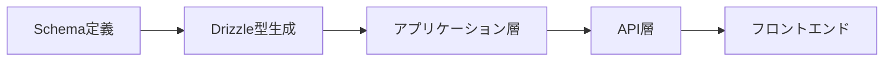
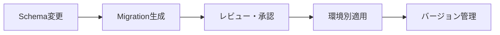
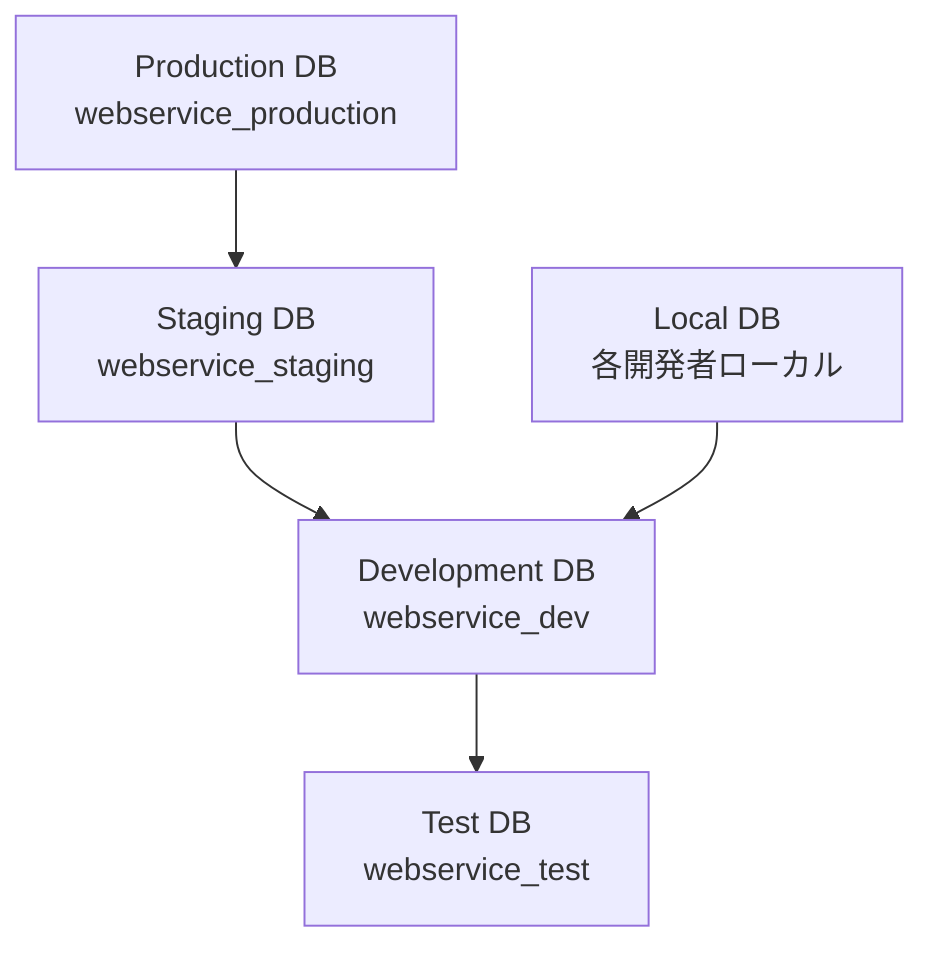

# データベース技術仕様書作成ガイドライン

**WebService-Next-Hono-Base** を基盤として実サービスを開発する際の、データベース技術仕様書作成における設計指針・テンプレートを提供します。

---

## 🎯 本ガイドラインの使い方

### 対象読者
- **データベース設計者**: スキーマ設計・データモデリング時
- **技術仕様書作成者**: DB設計書・ER図・マイグレーション仕様作成時  
- **開発リーダー**: データアーキテクチャ・パフォーマンス設計時

### 活用場面
- **データ設計**: エンティティ関係・正規化・インデックス設計時
- **仕様書作成**: スキーマ定義・制約・トランザクション仕様書作成時
- **マイグレーション計画**: データベース変更・バージョン管理仕様策定時
- **パフォーマンス設計**: クエリ最適化・スケーリング仕様策定時

---

## 🎯 WebService-Next-Hono-Base でのデータベース設計原則

### 本ベースプロジェクトのデータベース構成
このベースでは以下のデータベース技術スタックを前提としています：

| コンポーネント | 役割 | 仕様書での考慮点 |
|---------------|------|------------------|
| **PostgreSQL** | メインデータストレージ | スキーマ設計・制約・インデックス設計 |
| **Drizzle ORM** | 型安全ORM | スキーマ定義・マイグレーション設計 |
| **Better Auth** | 認証データ管理 | ユーザー・セッション・権限スキーマ統合 |
| **Zod** | データバリデーション | スキーマバリデーション・型整合性 |

### 技術仕様書で定義すべきデータベース要素

| 設計要素 | 技術仕様書での定義内容 | 本ベースでの実現方法 |
|---------|----------------------|---------------------|
| **スキーマ設計** | テーブル・カラム・制約・関係性 | Drizzleスキーマ定義 + 型生成 |
| **データ整合性** | 制約・トランザクション・バリデーション | PostgreSQL制約 + Zodバリデーション |
| **マイグレーション** | スキーマ変更・バージョン管理・ロールバック | Drizzleマイグレーション設計 |
| **パフォーマンス** | インデックス・クエリ最適化・分析 | PostgreSQL最適化 + 監視統合 |

---

## 📋 基本設計原則

### 1. 型安全性の優先


### 2. マイグレーション管理


### 3. 環境分離戦略

| 環境名 | ブランチ | データベース名 | 用途 |
|-------|----------|-------------|------|
| **Development** | `feature/*` | `webservice_dev` | 機能開発・PR確認 |
| **Staging** | `develop` | `webservice_staging` | 統合テスト・受入テスト |
| **Production** | `main` + `v*.*.*` | `webservice_production` | 本番稼働 |



---

## 📁 プロジェクトファイル構成

### ディレクトリ構造
```
ops/
  db/
    schema/
      users.ts          # ユーザー関連テーブル
      auth.ts           # 認証関連テーブル
      core.ts           # 共通テーブル・型定義
      index.ts          # スキーマ統合・エクスポート
    migrations/
      20250101000000_initial_schema.sql
      20250102000000_add_user_profiles.sql
      meta/
        _journal.json    # マイグレーション履歴
    seeds/
      dev.ts           # 開発用サンプルデータ
      test.ts          # テスト用データ
    drizzle.config.ts  # Drizzle設定
packages/
  infrastructure/
    db/
      client.ts        # データベース接続・クライアント
      types.ts         # 生成された型定義
      repositories/    # リポジトリパターン実装
```

---

## 🗃️ 基本スキーマ設計

### Better Auth統合のユーザー・認証テーブル

```typescript
// ops/db/schema/auth.ts
import { pgTable, text, timestamp, boolean, json } from 'drizzle-orm/pg-core'
import { createId } from '@paralleldrive/cuid2'

// ユーザーテーブル（Better Auth標準）
export const users = pgTable('users', {
  id: text('id').primaryKey().$defaultFn(() => createId()),
  email: text('email').notNull().unique(),
  emailVerified: boolean('email_verified').default(false),
  name: text('name').notNull(),
  image: text('image'),
  createdAt: timestamp('created_at', { withTimezone: true }).defaultNow().notNull(),
  updatedAt: timestamp('updated_at', { withTimezone: true }).defaultNow().notNull(),
})

// セッションテーブル（Better Auth標準）
export const sessions = pgTable('sessions', {
  id: text('id').primaryKey(),
  userId: text('user_id').notNull().references(() => users.id, { onDelete: 'cascade' }),
  expiresAt: timestamp('expires_at', { withTimezone: true }).notNull(),
  ipAddress: text('ip_address'),
  userAgent: text('user_agent'),
  createdAt: timestamp('created_at', { withTimezone: true }).defaultNow().notNull(),
})

// アカウントテーブル（OAuth対応）
export const accounts = pgTable('accounts', {
  id: text('id').primaryKey().$defaultFn(() => createId()),
  userId: text('user_id').notNull().references(() => users.id, { onDelete: 'cascade' }),
  accountId: text('account_id').notNull(),
  providerId: text('provider_id').notNull(),
  accessToken: text('access_token'),
  refreshToken: text('refresh_token'),
  expiresAt: timestamp('expires_at', { withTimezone: true }),
  createdAt: timestamp('created_at', { withTimezone: true }).defaultNow().notNull(),
})

// 検証トークンテーブル（メール認証等）
export const verificationTokens = pgTable('verification_tokens', {
  id: text('id').primaryKey().$defaultFn(() => createId()),
  token: text('token').notNull().unique(),
  identifier: text('identifier').notNull(), // email等
  expires: timestamp('expires', { withTimezone: true }).notNull(),
  createdAt: timestamp('created_at', { withTimezone: true }).defaultNow().notNull(),
})
```

### 拡張可能なユーザープロフィール設計

```typescript
// ops/db/schema/users.ts
import { pgTable, text, timestamp, integer, json } from 'drizzle-orm/pg-core'
import { users } from './auth.js'

// ユーザープロフィール拡張テーブル
export const userProfiles = pgTable('user_profiles', {
  id: text('id').primaryKey().$defaultFn(() => createId()),
  userId: text('user_id').notNull().references(() => users.id, { onDelete: 'cascade' }).unique(),
  displayName: text('display_name'),
  bio: text('bio'),
  location: text('location'),
  website: text('website'),
  birthDate: timestamp('birth_date'),
  timezone: text('timezone').default('UTC'),
  locale: text('locale').default('ja'),
  preferences: json('preferences').$type<UserPreferences>(),
  createdAt: timestamp('created_at', { withTimezone: true }).defaultNow().notNull(),
  updatedAt: timestamp('updated_at', { withTimezone: true }).defaultNow().notNull(),
})

// 型安全なJSONスキーマ定義
export interface UserPreferences {
  theme: 'light' | 'dark' | 'system'
  notifications: {
    email: boolean
    push: boolean
    sms: boolean
  }
  privacy: {
    profilePublic: boolean
    showEmail: boolean
    showLocation: boolean
  }
}

// ユーザーロール・権限管理
export const userRoles = pgTable('user_roles', {
  id: text('id').primaryKey().$defaultFn(() => createId()),
  userId: text('user_id').notNull().references(() => users.id, { onDelete: 'cascade' }),
  role: text('role').notNull(), // 'admin', 'moderator', 'user'
  grantedBy: text('granted_by').references(() => users.id),
  grantedAt: timestamp('granted_at', { withTimezone: true }).defaultNow().notNull(),
  expiresAt: timestamp('expires_at', { withTimezone: true }),
})
```

### 共通パターン・ユーティリティ

```typescript
// ops/db/schema/core.ts
import { timestamp, text } from 'drizzle-orm/pg-core'
import { createId } from '@paralleldrive/cuid2'

// 共通フィールドのヘルパー
export const commonFields = {
  id: () => text('id').primaryKey().$defaultFn(() => createId()),
  createdAt: () => timestamp('created_at', { withTimezone: true }).defaultNow().notNull(),
  updatedAt: () => timestamp('updated_at', { withTimezone: true }).defaultNow().notNull(),
  createdBy: (tableName?: string) => text('created_by').references(() => users.id),
  updatedBy: (tableName?: string) => text('updated_by').references(() => users.id),
}

// ソフトデリート対応
export const softDeleteFields = {
  deletedAt: () => timestamp('deleted_at', { withTimezone: true }),
  deletedBy: () => text('deleted_by').references(() => users.id),
}

// タイムスタンプ自動更新トリガー
export const timestampTriggers = `
  CREATE OR REPLACE FUNCTION update_updated_at_column()
  RETURNS TRIGGER AS $$
  BEGIN
    NEW.updated_at = CURRENT_TIMESTAMP;
    RETURN NEW;
  END;
  $$ language 'plpgsql';
`;

---

## 🚦 レートリミット・セキュリティ関連のデータベース設計

### レートリミット管理テーブル設計
**レートリミットパッケージ**の永続化ストレージとしてのデータベース設計指針：

#### パッケージ別ストレージ戦略
```markdown
## ストレージ選択指針

### パッケージ別推奨ストレージ
| パッケージ | 主ストレージ | 補助ストレージ | 用途分離 |
|-----------|-------------|---------------|----------|
| **@hono/rate-limiter** | Memory | PostgreSQL | 状態：メモリ / 履歴：DB |
| **hono-rate-limiter** | Redis | PostgreSQL | リアルタイム：Redis / 分析：DB |
| **redis-rate-limiter** | Redis | PostgreSQL | 全て：Redis / バックアップ：DB |

### データベース設計パターン
- **ハイブリッド型**: Redis（高速アクセス）+ PostgreSQL（永続化・分析）
- **ログ特化型**: 制限状態はパッケージ任せ、違反ログのみDB管理
- **設定管理型**: 動的な制限設定変更をDB管理
```

#### レートリミット状態管理
```typescript
// ops/db/schema/rate-limits.ts
import { pgTable, text, integer, timestamp, index } from 'drizzle-orm/pg-core'

// レートリミット状態テーブル
export const rateLimitStates = pgTable('rate_limit_states', {
  id: text('id').primaryKey().$defaultFn(() => createId()),
  key: text('key').notNull().unique(), // IP_endpoint または userID_endpoint
  scope: text('scope').notNull(), // 'ip', 'user', 'api_key'
  identifier: text('identifier').notNull(), // IP address, user ID, API key
  endpoint: text('endpoint').notNull(), // API endpoint path
  requestCount: integer('request_count').notNull().default(0),
  windowStart: timestamp('window_start', { withTimezone: true }).notNull(),
  windowEnd: timestamp('window_end', { withTimezone: true }).notNull(),
  lastRequest: timestamp('last_request', { withTimezone: true }).defaultNow().notNull(),
  isBlocked: boolean('is_blocked').default(false),
  blockExpiresAt: timestamp('block_expires_at', { withTimezone: true }),
  createdAt: timestamp('created_at', { withTimezone: true }).defaultNow().notNull(),
  updatedAt: timestamp('updated_at', { withTimezone: true }).defaultNow().notNull(),
}, (table) => ({
  keyIdx: index('rate_limit_key_idx').on(table.key),
  identifierIdx: index('rate_limit_identifier_idx').on(table.identifier),
  endpointIdx: index('rate_limit_endpoint_idx').on(table.endpoint),
  windowEndIdx: index('rate_limit_window_end_idx').on(table.windowEnd),
}))

// レートリミット違反ログテーブル
export const rateLimitViolations = pgTable('rate_limit_violations', {
  id: text('id').primaryKey().$defaultFn(() => createId()),
  identifier: text('identifier').notNull(), // IP または UserID
  endpoint: text('endpoint').notNull(),
  method: text('method').notNull(),
  userAgent: text('user_agent'),
  referer: text('referer'),
  requestsAttempted: integer('requests_attempted').notNull(),
  limitAllowed: integer('limit_allowed').notNull(),
  windowDuration: text('window_duration').notNull(), // '15m', '1h'
  violationType: text('violation_type').notNull(), // 'soft', 'hard', 'malicious'
  blockDuration: integer('block_duration'), // 秒数
  isAutoBlocked: boolean('is_auto_blocked').default(false),
  clientInfo: json('client_info').$type<{
    ip: string
    country?: string
    userAgent: string
    headers: Record<string, string>
  }>(),
  createdAt: timestamp('created_at', { withTimezone: true }).defaultNow().notNull(),
}, (table) => ({
  identifierIdx: index('violation_identifier_idx').on(table.identifier),
  endpointIdx: index('violation_endpoint_idx').on(table.endpoint),
  createdAtIdx: index('violation_created_at_idx').on(table.createdAt),
  violationTypeIdx: index('violation_type_idx').on(table.violationType),
}))

// IP遮断管理テーブル
export const ipBlockList = pgTable('ip_block_list', {
  id: text('id').primaryKey().$defaultFn(() => createId()),
  ipAddress: text('ip_address').notNull().unique(),
  reason: text('reason').notNull(), // 'rate_limit', 'suspicious', 'manual'
  blockType: text('block_type').notNull(), // 'temporary', 'permanent'
  expiresAt: timestamp('expires_at', { withTimezone: true }),
  blockedBy: text('blocked_by').references(() => users.id), // 手動遮断時の管理者
  autoBlocked: boolean('auto_blocked').default(true),
  violationCount: integer('violation_count').notNull().default(1),
  lastViolation: timestamp('last_violation', { withTimezone: true }).defaultNow().notNull(),
  notes: text('notes'), // 管理者メモ
  createdAt: timestamp('created_at', { withTimezone: true }).defaultNow().notNull(),
  updatedAt: timestamp('updated_at', { withTimezone: true }).defaultNow().notNull(),
}, (table) => ({
  ipIdx: index('ip_block_ip_idx').on(table.ipAddress),
  expiresAtIdx: index('ip_block_expires_idx').on(table.expiresAt),
  blockTypeIdx: index('ip_block_type_idx').on(table.blockType),
}))
```

#### レートリミット設定管理
```typescript
// レートリミット設定テーブル（動的設定変更用）
export const rateLimitConfigs = pgTable('rate_limit_configs', {
  id: text('id').primaryKey().$defaultFn(() => createId()),
  endpoint: text('endpoint').notNull(), // '/auth/login', '/api/users'
  method: text('method'), // 'POST', 'GET', null（全メソッド）
  scope: text('scope').notNull(), // 'ip', 'user', 'api_key'
  requestLimit: integer('request_limit').notNull(),
  windowDuration: text('window_duration').notNull(), // '15m', '1h', '1d'
  blockDuration: text('block_duration'), // '15m', '1h'
  isActive: boolean('is_active').default(true),
  priority: integer('priority').default(0), // 優先順位（高い値が優先）
  description: text('description'),
  createdBy: text('created_by').references(() => users.id),
  createdAt: timestamp('created_at', { withTimezone: true }).defaultNow().notNull(),
  updatedAt: timestamp('updated_at', { withTimezone: true }).defaultNow().notNull(),
}, (table) => ({
  endpointIdx: index('rate_config_endpoint_idx').on(table.endpoint),
  scopeIdx: index('rate_config_scope_idx').on(table.scope),
  priorityIdx: index('rate_config_priority_idx').on(table.priority),
}))
```

#### データベース設計のベストプラクティス
```markdown
## レートリミットDB設計の考慮点

### パフォーマンス設計
- インデックス設計: 検索頻度の高いカラム（key, identifier, endpoint）
- パーティション設計: 日付別パーティションで古いデータ自動削除
- TTL設定: 期限切れレコードの自動クリーンアップ

### データ保持戦略
- リアルタイム状態: 7日間保持（rate_limit_states）
- 違反ログ: 90日間保持（rate_limit_violations）  
- 遮断履歴: 1年間保持（ip_block_list）

### 運用・監視クエリ例
```sql
-- 現在の制限状況確認
SELECT endpoint, COUNT(*) as active_limits
FROM rate_limit_states 
WHERE window_end > NOW() 
GROUP BY endpoint;

-- 頻繁な違反者の特定
SELECT identifier, COUNT(*) as violation_count
FROM rate_limit_violations 
WHERE created_at > NOW() - INTERVAL '24 hours'
GROUP BY identifier 
ORDER BY violation_count DESC 
LIMIT 10;
```
```

// 使用例：記事テーブル
export const posts = pgTable('posts', {
  ...commonFields,
  title: text('title').notNull(),
  content: text('content').notNull(),
  slug: text('slug').notNull().unique(),
  status: text('status').default('draft'), // 'draft', 'published', 'archived'
  ...softDeleteFields,
})
```

---

## 🔧 Drizzle設定・接続管理

### データベース接続設定

```typescript
// packages/infrastructure/db/client.ts
import { drizzle } from 'drizzle-orm/postgres-js'
import postgres from 'postgres'
import * as schema from '../../../ops/db/schema/index.js'

// 環境別接続設定
const createConnection = () => {
  const connectionString = process.env.DATABASE_URL
  if (!connectionString) {
    throw new Error('DATABASE_URL environment variable is required')
  }

  // 接続プール設定
  const client = postgres(connectionString, {
    max: process.env.NODE_ENV === 'production' ? 20 : 5,
    idle_timeout: 20,
    connect_timeout: 10,
    prepare: false, // Better Auth compatibility
  })

  return drizzle(client, { 
    schema,
    logger: process.env.NODE_ENV === 'development'
  })
}

// シングルトンパターンでDB接続を管理
let db: ReturnType<typeof createConnection> | null = null

export const getDb = () => {
  if (!db) {
    db = createConnection()
  }
  return db
}

// 型エクスポート
export type DbClient = ReturnType<typeof getDb>
export { schema }
```

### Drizzle Kit設定

```typescript
// ops/db/drizzle.config.ts
import type { Config } from 'drizzle-kit'
import { loadEnv } from '../dev/utils/env.js'

// 環境変数読み込み
loadEnv()

export default {
  schema: './ops/db/schema/index.ts',
  out: './ops/db/migrations',
  driver: 'pg',
  dbCredentials: {
    connectionString: process.env.DATABASE_URL!,
  },
  verbose: true,
  strict: true,
  // 本番環境では危険なコマンドを無効化
  tablesFilter: process.env.NODE_ENV === 'production' ? [] : undefined,
} satisfies Config
```

---

## 📊 インデックス戦略・パフォーマンス最適化

### 基本インデックス設計

```typescript
// ops/db/schema/indexes.ts
import { index, uniqueIndex } from 'drizzle-orm/pg-core'
import { users, sessions, userProfiles, posts } from './index.js'

// ユーザー関連インデックス
export const userEmailIndex = uniqueIndex('user_email_idx').on(users.email)
export const userCreatedAtIndex = index('user_created_at_idx').on(users.createdAt)

// セッション関連インデックス
export const sessionUserIdIndex = index('session_user_id_idx').on(sessions.userId)
export const sessionExpiresAtIndex = index('session_expires_at_idx').on(sessions.expiresAt)

// プロフィール関連インデックス
export const profileUserIdIndex = uniqueIndex('profile_user_id_idx').on(userProfiles.userId)

// 記事関連インデックス（例）
export const postSlugIndex = uniqueIndex('post_slug_idx').on(posts.slug)
export const postStatusIndex = index('post_status_idx').on(posts.status)
export const postCreatedAtIndex = index('post_created_at_idx').on(posts.createdAt)

// 複合インデックス例
export const postStatusCreatedIndex = index('post_status_created_idx')
  .on(posts.status, posts.createdAt)
```

### クエリ最適化パターン

```typescript
// packages/infrastructure/db/repositories/user.repository.ts
import { eq, and, or, desc, count, sql } from 'drizzle-orm'
import { getDb } from '../client.js'
import { users, userProfiles, sessions } from '../../../../ops/db/schema/index.js'

export class UserRepository {
  private db = getDb()

  // 効率的なユーザー情報取得（JOIN使用）
  async getUserWithProfile(userId: string) {
    return await this.db
      .select({
        id: users.id,
        email: users.email,
        name: users.name,
        image: users.image,
        profile: {
          displayName: userProfiles.displayName,
          bio: userProfiles.bio,
          location: userProfiles.location,
          preferences: userProfiles.preferences,
        }
      })
      .from(users)
      .leftJoin(userProfiles, eq(users.id, userProfiles.userId))
      .where(eq(users.id, userId))
      .limit(1)
  }

  // ページネーション対応のユーザー一覧
  async getUsersWithPagination(page = 1, limit = 20) {
    const offset = (page - 1) * limit

    const [usersData, totalCount] = await Promise.all([
      this.db
        .select()
        .from(users)
        .orderBy(desc(users.createdAt))
        .limit(limit)
        .offset(offset),
      
      this.db
        .select({ count: count() })
        .from(users)
    ])

    return {
      users: usersData,
      pagination: {
        page,
        limit,
        total: totalCount[0].count,
        pages: Math.ceil(totalCount[0].count / limit),
        hasNext: page * limit < totalCount[0].count,
        hasPrev: page > 1,
      }
    }
  }

  // アクティブセッション数の取得
  async getActiveSessionCount(userId: string) {
    const result = await this.db
      .select({ count: count() })
      .from(sessions)
      .where(
        and(
          eq(sessions.userId, userId),
          sql`${sessions.expiresAt} > NOW()`
        )
      )
    
    return result[0].count
  }
}
```

---

## 🔄 マイグレーション管理

### マイグレーション実行フロー

```bash
# 環境別マイグレーション手順

# 1. スキーマ変更後、マイグレーション生成
pnpm db:generate

# 2. 生成されたマイグレーションをレビュー
# ops/db/migrations/ 内のSQLファイルを確認

# 3. Development環境に適用（ローカル開発）
infisical run --env=development -- pnpm db:migrate

# 4. Staging環境に適用（統合テスト）
infisical run --env=staging -- pnpm db:migrate

# 5. Production環境への適用（本番デプロイ時・慎重に）
infisical run --env=production -- pnpm db:migrate:prod
```

### package.json スクリプト設定

```json
{
  "scripts": {
    "db:generate": "drizzle-kit generate:pg --config=ops/db/drizzle.config.ts",
    "db:migrate": "drizzle-kit push:pg --config=ops/db/drizzle.config.ts",
    "db:migrate:prod": "drizzle-kit migrate:pg --config=ops/db/drizzle.config.ts",
    "db:studio": "drizzle-kit studio --config=ops/db/drizzle.config.ts",
    "db:drop": "drizzle-kit drop --config=ops/db/drizzle.config.ts",
    "db:seed": "tsx ops/db/seeds/dev.ts",
    "db:seed:test": "tsx ops/db/seeds/test.ts"
  }
}
```

### マイグレーション安全性チェック

```typescript
// ops/db/migrations/safety-check.ts
export const migrationSafetyChecklist = {
  // 危険な操作の検出
  dangerousOperations: [
    'DROP TABLE',
    'DROP COLUMN', 
    'ALTER COLUMN ... DROP NOT NULL',
    'ALTER COLUMN ... TYPE', // データ変換を伴う型変更
  ],
  
  // 本番適用前の確認事項
  preProductionChecklist: [
    '□ ステージング環境でのテスト完了',
    '□ データバックアップ取得済み',
    '□ ロールバック手順の確認済み',
    '□ 影響するテーブルのレコード数確認',
    '□ インデックス再構築時間の見積もり',
    '□ アプリケーション停止時間の調整',
  ]
}
```

---

## 🧪 テストデータ・シード管理

### 開発用シードデータ

```typescript
// ops/db/seeds/dev.ts
import { getDb } from '../../packages/infrastructure/db/client.js'
import { users, userProfiles } from '../schema/index.js'
import { createId } from '@paralleldrive/cuid2'

const db = getDb()

export async function seedDevData() {
  console.log('🌱 Seeding development data...')

  // サンプルユーザーの作成
  const sampleUsers = [
    {
      id: createId(),
      email: 'admin@example.com',
      name: '管理者',
      emailVerified: true,
    },
    {
      id: createId(),
      email: 'user1@example.com', 
      name: 'テストユーザー1',
      emailVerified: true,
    },
    {
      id: createId(),
      email: 'user2@example.com',
      name: 'テストユーザー2', 
      emailVerified: false,
    }
  ]

  // ユーザー挿入
  const insertedUsers = await db.insert(users).values(sampleUsers).returning()
  
  // プロフィール作成
  const profiles = insertedUsers.map(user => ({
    id: createId(),
    userId: user.id,
    displayName: `${user.name}（表示名）`,
    bio: `${user.name}のプロフィールです。`,
    timezone: 'Asia/Tokyo',
    locale: 'ja',
    preferences: {
      theme: 'light' as const,
      notifications: {
        email: true,
        push: true, 
        sms: false,
      },
      privacy: {
        profilePublic: true,
        showEmail: false,
        showLocation: true,
      }
    }
  }))

  await db.insert(userProfiles).values(profiles)

  console.log('✅ Development data seeded successfully!')
}

// 直接実行の場合
if (import.meta.url === `file://${process.argv[1]}`) {
  seedDevData().catch(console.error)
}
```

### テスト用データファクトリー

```typescript
// ops/db/seeds/factories.ts
import { faker } from '@faker-js/faker/locale/ja'
import { createId } from '@paralleldrive/cuid2'
import type { UserPreferences } from '../schema/users.js'

export const UserFactory = {
  build: (overrides: Partial<typeof users.$inferInsert> = {}) => ({
    id: createId(),
    email: faker.internet.email(),
    name: faker.person.fullName(),
    emailVerified: faker.datatype.boolean(0.8), // 80%の確率でtrue
    createdAt: new Date(),
    updatedAt: new Date(),
    ...overrides,
  }),

  buildMany: (count: number, overrides: Partial<typeof users.$inferInsert> = {}) => {
    return Array.from({ length: count }, () => UserFactory.build(overrides))
  }
}

export const UserProfileFactory = {
  build: (userId: string, overrides: Partial<typeof userProfiles.$inferInsert> = {}) => ({
    id: createId(),
    userId,
    displayName: faker.person.fullName(),
    bio: faker.lorem.paragraph(),
    location: faker.location.city(),
    website: faker.internet.url(),
    timezone: faker.helpers.arrayElement(['Asia/Tokyo', 'UTC', 'America/New_York']),
    locale: faker.helpers.arrayElement(['ja', 'en', 'ko']),
    preferences: {
      theme: faker.helpers.arrayElement(['light', 'dark', 'system']),
      notifications: {
        email: faker.datatype.boolean(),
        push: faker.datatype.boolean(),
        sms: faker.datatype.boolean(),
      },
      privacy: {
        profilePublic: faker.datatype.boolean(0.7),
        showEmail: faker.datatype.boolean(0.3),
        showLocation: faker.datatype.boolean(0.6),
      }
    } satisfies UserPreferences,
    createdAt: new Date(),
    updatedAt: new Date(),
    ...overrides,
  })
}
```

---

## 🛡️ セキュリティ・パフォーマンス考慮事項

### セキュリティベストプラクティス

```typescript
// packages/infrastructure/db/security.ts

// 1. SQLインジェクション対策（Drizzleで自動的に対策済み）
export const safeQuery = {
  // ❌ 危険：生のSQL
  unsafe: (userInput: string) => sql`SELECT * FROM users WHERE name = ${userInput}`,
  
  // ✅ 安全：パラメータ化クエリ
  safe: (userInput: string) => db.select().from(users).where(eq(users.name, userInput))
}

// 2. データアクセス制御
export const secureUserQuery = (requestUserId: string, targetUserId: string) => {
  // 自分のデータか管理者権限をチェック
  const isOwner = requestUserId === targetUserId
  const isAdmin = checkAdminRole(requestUserId) // 実装は省略
  
  if (!isOwner && !isAdmin) {
    throw new Error('Unauthorized access to user data')
  }
  
  return db.select().from(users).where(eq(users.id, targetUserId))
}

// 3. 機密情報の除外
export const publicUserFields = {
  id: users.id,
  name: users.name,
  image: users.image,
  // email, createdAt は除外
}
```

### パフォーマンス監視

```typescript
// packages/infrastructure/db/monitoring.ts
import { performance } from 'perf_hooks'

export const withQueryLogging = async <T>(
  queryName: string, 
  queryFn: () => Promise<T>
): Promise<T> => {
  const start = performance.now()
  
  try {
    const result = await queryFn()
    const duration = performance.now() - start
    
    // 遅いクエリの警告
    if (duration > 1000) { // 1秒以上
      console.warn(`🐌 Slow query detected: ${queryName} took ${duration.toFixed(2)}ms`)
    }
    
    // メトリクス送信（本番環境）
    if (process.env.NODE_ENV === 'production') {
      // sendMetrics('db.query.duration', duration, { query: queryName })
    }
    
    return result
  } catch (error) {
    console.error(`❌ Query failed: ${queryName}`, error)
    throw error
  }
}

// 使用例
export const getUserById = (id: string) =>
  withQueryLogging('getUserById', () =>
    db.select().from(users).where(eq(users.id, id)).limit(1)
  )
```

---

## ✅ データベース設計チェックリスト

### スキーマ設計
- [ ] テーブル名・カラム名がsnake_caseで統一されている
- [ ] 主キーがtext型のCUID2で設定されている
- [ ] 外部キー制約が適切に設定されている（onDelete: 'cascade'等）
- [ ] NOT NULL制約が適切に設定されている
- [ ] ユニーク制約が必要な項目に設定されている
- [ ] タイムスタンプ（created_at, updated_at）が全テーブルに設定されている
- [ ] Better Auth用テーブルが正しく定義されている

### インデックス設計
- [ ] 検索で使用される項目にインデックスが設定されている
- [ ] 複合インデックスの項目順序が最適化されている
- [ ] ユニークインデックスが適切に設定されている
- [ ] 不要なインデックスが除去されている

### マイグレーション
- [ ] マイグレーションファイルが適切に生成されている
- [ ] 危険な操作（DROP等）が本番適用前にレビューされている
- [ ] ロールバック手順が準備されている
- [ ] ステージング環境でテスト済み

### セキュリティ
- [ ] SQLインジェクション対策（Drizzleクエリビルダー使用）
- [ ] 機密情報の適切な除外（公開API用）
- [ ] アクセス制御の実装
- [ ] パスワード等の機密データの暗号化確認

### パフォーマンス
- [ ] 遅いクエリの最適化
- [ ] N+1問題の回避（JOIN使用）
- [ ] ページネーション実装
- [ ] クエリ実行時間の監視設定

---

## 🛠️ 開発・デバッグツール

### Drizzle Studio の活用

```bash
# Drizzle Studio の起動（GUIでDB確認・編集）
pnpm db:studio

# ブラウザで http://localhost:4983 にアクセス
# テーブル構造・データの確認・編集が可能
```

### デバッグ用クエリ

```typescript
// packages/infrastructure/db/debug.ts
import { getDb } from './client.js'

export const debugQueries = {
  // テーブル情報の確認
  async getTableInfo(tableName: string) {
    const db = getDb()
    return await db.execute(sql`
      SELECT column_name, data_type, is_nullable, column_default
      FROM information_schema.columns 
      WHERE table_name = ${tableName}
      ORDER BY ordinal_position
    `)
  },

  // インデックス情報の確認
  async getIndexInfo(tableName: string) {
    const db = getDb()
    return await db.execute(sql`
      SELECT indexname, indexdef
      FROM pg_indexes 
      WHERE tablename = ${tableName}
    `)
  },

  // クエリ実行計画の確認
  async explainQuery(query: string) {
    const db = getDb()
    return await db.execute(sql`EXPLAIN ANALYZE ${sql.raw(query)}`)
  }
}
```

---

## 🎯 次のステップ

1. **基本スキーマの実装**: Better Auth対応のユーザー・認証テーブル
2. **マイグレーション設定**: Drizzle Kit設定とマイグレーション実行環境
3. **リポジトリパターン実装**: 型安全なデータアクセス層の構築
4. **テストデータ整備**: 開発・テスト用のシードデータ作成
5. **パフォーマンス最適化**: インデックス・クエリ最適化の実装

---

## 📚 参考資料

### Drizzle ORM
- [Drizzle ORM Documentation](https://orm.drizzle.team/)
- [PostgreSQL with Drizzle](https://orm.drizzle.team/docs/get-started-postgresql)
- [Drizzle Kit CLI](https://orm.drizzle.team/kit-docs/overview)

### PostgreSQL
- [PostgreSQL Documentation](https://www.postgresql.org/docs/)
- [PostgreSQL Performance Tips](https://wiki.postgresql.org/wiki/Performance_Optimization)

### Better Auth統合
- [Better Auth with Drizzle](https://www.better-auth.com/docs/adapters/drizzle-adapter)

---

© 2025 WebService-Next-Hono-Base Development Team
